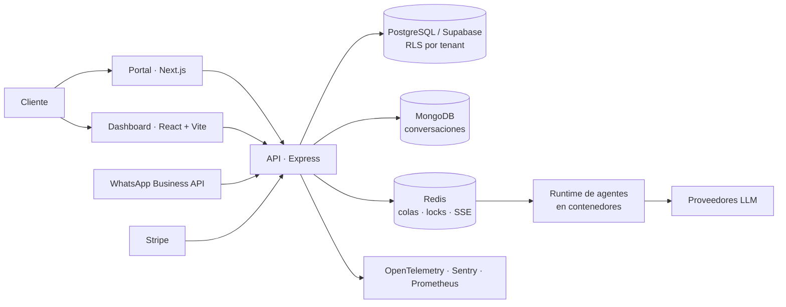

# LuckAgents — plataforma SaaS multi-tenant de agentes de IA

**Rol:** diseño e implementación · **Periodo:** 2025 – presente · **Código:** privado

Monorepo pnpm + Turborepo con 10 workspaces. Un portal público en Next.js, un dashboard de operación en React/Vite, una API en Express con 42 módulos de rutas y un runtime de agentes que corre en contenedores, sobre PostgreSQL/Supabase, MongoDB y Redis.

## Decisiones que sostienen el sistema

### El aislamiento entre clientes vive en la base de datos, no en el controlador

Un SaaS multi-tenant que filtra por `tenantId` en el código tiene tantos puntos de fuga como consultas. Aquí el corte está en PostgreSQL: 31 políticas de Row Level Security — 23 directas y 8 mediadas por una función `current_tenant_id()` — que exigen membresía **activa** y preservan el rol de servicio para las tareas del sistema.

La lección llegó por una auditoría, no por un incidente: las membresías en estado `suspended` e `invited` conservaban lectura directa. Ningún endpoint estaba mal escrito; la fuga estaba en la política. Desde entonces cada cambio de permisos entra con su prueba de regresión sobre RLS, porque un bug de aislamiento no se ve leyendo el controlador.

> El patrón está publicado, aislado y ejecutable en **[multi-tenant-rls](https://github.com/joshua-angulo/multi-tenant-rls)**: 16 pruebas en su mayoría negativas, más una verificación por mutación que comprueba que la suite detecta su propio fallo.

### Los efectos externos son idempotentes por contrato

Stripe y WhatsApp Business pueden reenviar webhooks. Para reducir el riesgo de cobros o mensajes duplicados, cada efecto externo se ejecuta bajo clave de idempotencia, con locks distribuidos en Redis para las secciones que no pueden solaparse entre instancias. La regla operativa que se sigue de ahí: ante la duda, el sistema falla cerrado — prefiere no actuar a actuar dos veces.

### SSE para el streaming de agentes

La conversación con un agente es unidireccional del servidor al cliente. Server-Sent Events sobre HTTP se reconecta solo, atraviesa proxies corporativos sin negociación de protocolo y se instrumenta con las mismas trazas que el resto de la API. Un WebSocket habría añadido un canal bidireccional que nadie necesitaba y una superficie de fallo más que operar.

### Los secretos no pasan por el repositorio

La fuente de verdad de configuración es un gestor de secretos externo; en git solo viven plantillas sin valores. El hook de pre-commit corre un escaneo de secretos **fail-closed**: si no puede verificar, bloquea. Es más barato rechazar un commit legítimo que rotar credenciales filtradas.

### Observabilidad desde el diseño

Trazas OpenTelemetry, errores en Sentry y métricas en Prometheus se instrumentaron junto con las funcionalidades, no después. El costo de añadirlas al final es reescribir los bordes del sistema justo cuando ya está en uso.

## Auditoría de modernización

En julio de 2026 el monorepo pasó por una auditoría integral. Estado inicial y resultado:

| Frente | Antes | Después |
|---|---|---|
| Cadena de suministro | 155 rutas vulnerables en dependencias de producción: 4 críticas, 73 altas, 66 moderadas, 12 bajas | 0 advisories conocidos |
| Aislamiento multi-tenant | membresías `suspended`/`invited` con lectura directa en 31 políticas | migración forward: membresía activa exigida en las 31 |
| Autenticación | flujo OAuth heredado conviviendo con SSO | OAuth heredado eliminado |
| CI/CD | pipeline sin análisis estático de seguridad | GitHub Actions con CodeQL y revisión de dependencias |

Evidencia de validación local al cierre: **619** pruebas de API aprobadas (0 fallos, 1 omitida por diseño), **371/371** unitarias y de UI del dashboard, **76/76** end-to-end en Chromium y Firefox, y build global 10/10. En total 1,066 pruebas automatizadas.

## Lo que la auditoría concluyó, y por qué lo publico

**El dictamen fue NO-GO para producción.** El árbol estaba verde en local, con la suite completa pasando, y aun así no era desplegable: quedaban abiertos gates externos —conectividad del clúster gestionado, la API y Redis en el proveedor de infraestructura— que ninguna prueba local podía cubrir.

Publico esto porque separar "mi suite pasa" de "esto se puede operar" es la parte del oficio que más caro cuesta aprender. Un sistema que cobra dinero y habla con clientes reales no se promueve porque el CI esté verde; se promueve cuando los gates externos están verificados en el entorno real y existe una ruta de recuperación probada.

## Qué haría distinto

- Escribir las políticas de RLS **antes** que los endpoints, y con su prueba negativa: una consulta que debe fallar y falla.
- Definir el contrato de entorno como código desde el primer día, no cuando ya hay tres aplicaciones con variables divergentes.
- Fijar el criterio de "listo para producción" al principio del proyecto, con sus gates externos escritos; si se define al final, se define bajo presión.

---

**In English.** LuckAgents is a multi-tenant AI-agent SaaS: a pnpm/Turborepo monorepo with 10 workspaces, an Express API, a React/Vite dashboard, a Next.js portal and a containerized agent runtime on PostgreSQL/Supabase, MongoDB and Redis. Tenant isolation is enforced in the database through 31 RLS policies rather than in controllers; external side effects are idempotent by contract; secrets never reach the repository, guarded by a fail-closed pre-commit scan. A July 2026 modernization audit took 155 vulnerable production dependency paths to zero and left 1,066 automated tests passing — and still returned a **NO-GO for production**, because external infrastructure gates remained unverified. That distinction between "my suite is green" and "this can be operated" is the reason the case study exists.
