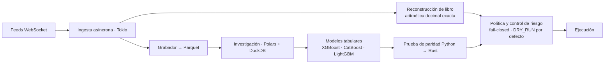

# Plataforma cuantitativa para mercados electrónicos

**Rol:** diseño e implementación · **Periodo:** 2026 – presente · **Código:** privado

Dos mitades que tienen que decir lo mismo: un runtime asíncrono en Rust que consume feeds en tiempo real y decide bajo restricciones de latencia, y una plataforma de investigación en Python que entrena y valida los modelos que ese runtime ejecuta. 534 commits, 1,309 funciones de prueba en Rust y 535 archivos de prueba en Python.

Este documento describe **cómo está construido**, no qué opera ni con qué parámetros. No incluye venue, instrumento, umbrales ni resultado alguno.

## Decisiones que sostienen el sistema

### El dinero no es `f64`

Todas las rutas de orden y ejecución usan aritmética decimal exacta (`rust_decimal`). El punto flotante binario solo aparece donde el error de redondeo es irrelevante: límites de riesgo agregados. Es una regla aburrida hasta el día en que una diferencia de un ulp cruza un umbral de precio y la posición queda en un estado que ninguna prueba modeló.

### Python y Rust tienen que puntuar idéntico, y hay una prueba que lo exige

El modelo se entrena en Python y se ejecuta en Rust. Cualquier divergencia —un orden de features distinto, un redondeo, una diferencia de tipo— convierte la validación histórica en ficción. La paridad no se asume: es un test de contrato que compara las salidas de ambas implementaciones sobre vectores dorados y falla el pipeline si se separan. Ocho pruebas de contrato más el gate de calidad guardan esa frontera.

### Los datos de evaluación se gastan; no se reciclan

Antes de abrir cualquier fila de evaluación se preregistra el juez: qué días, qué hashes de modelo congelados y qué barras de aceptación. Un día cuyos resultados ya se miraron queda quemado a entrenamiento para siempre, y ese estado —sellado o quemado— se registra de forma explícita.

Es la disciplina que separa un backtest de una ilusión. Los diagnósticos sobre días legítimos de entrenamiento son ilimitados, pero nunca son una afirmación de aceptación: esa solo sale de una ventana prospectiva preregistrada. La validación es walk-forward, con control de fuga temporal en cada frontera.

### Un kill-switch sin prueba negativa no es evidencia

Un control de integridad que nunca ha fallado no demuestra nada: puede estar apagado. Cada control lleva una prueba que **inyecta corrupción y verifica que el sistema falla**. Lo mismo vale para el estado por defecto del runtime: el modo simulado está activo salvo confirmación explícita, y el paso a operación real exige grabador, libro de órdenes y una confirmación aparte. Fail-closed en el default, no en el manual de operación.

### La evidencia está atada a un hash, o no existe

Cada veredicto del programa se registra en una bitácora append-only con su evidencia legible por máquina bajo control de versiones, ligada por SHA-256. Un resultado que solo vive en un directorio ignorado por git no cuenta como evidencia. La consecuencia práctica: cualquier afirmación del proyecto se puede reabrir en el commit exacto que la produjo.

### Atribuir antes de amputar

Cuando un segmento de datos se ve mal, la tentación es cortarlo. Aquí un segmento solo sale del entrenamiento después de una atribución basada en evidencia: descartar mecánicamente confusores de comisiones, API o fuente, pruebas de transferencia en ambas direcciones y dosis-respuesta. Nunca por un solo delta agregado — así es como se elimina justo la señal que incomoda.

## Por qué esto importa fuera de un mercado

Cambia el dominio y las restricciones se mantienen: dinero que no admite redondeo, decisiones con trazabilidad auditable, reintentos que no pueden duplicar un efecto, controles que deben probarse fallando y una frontera nítida entre lo que se midió y lo que se supone. Es la misma ingeniería que exige un sistema transaccional regulado, con la ventaja de que aquí el error no se esconde: se paga.

---

**In English.** A quantitative research and execution platform for electronic markets: an async Rust runtime (Tokio) consuming real-time WebSocket feeds, rebuilding order books with exact decimal arithmetic and deciding under latency constraints, paired with a Python research stack (Parquet, Polars, DuckDB, gradient-boosted tabular models). 534 commits, 1,309 Rust test functions, 535 Python test files. The engineering thesis: money never touches binary floating point on order paths; Python and Rust must score identically and a parity contract test enforces it; evaluation data is spent, not reused, with a preregistered judge and walk-forward validation; an integrity check without a negative test proving it fails on injected corruption is not evidence; and every verdict is hash-bound to committed evidence. Venue, instrument, thresholds and results are deliberately omitted.
